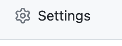
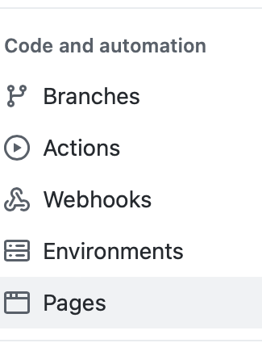
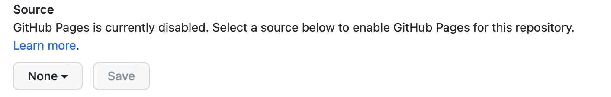
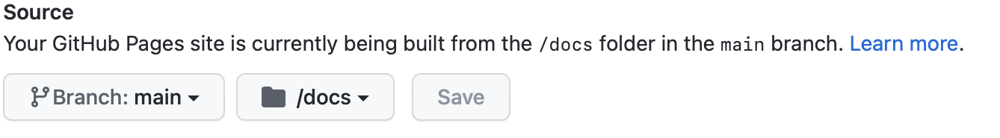

## Publishing your documentation

The point of documentation is that is meant to be read by the people
who will be using the code that it references.

This means providing it to this audience through a standard and consumable medium.


## Creating a full documentation suite
Your JSDoc-compatible document rendering engine will create an API document in either HTML or Markdown.

Perhaps you also would like to include additional documentation materials to create a more complete "manual".

### Creating a documentation suite using html
Suppose your configuration produces html output into the folder docs/html.  You want to frame this up with an introduction page
and perhaps some other reference pages.

Create an index.html file in your 'docs' folder that looks something like this:
```html
<!DOCTYPE html>
<html lang="en">
<head>
    <meta charset="UTF-8">
    <title>The Awesome Project</title>
</head>
<body>
  <h3>Welcome to The Awesome Project!</h3>
  <p>Here is some interesting information about this project or product
  and probably links to other pages</p>
  <p>
    See our <a href="html/index.html">API Documentation</a> for reference!
  </p>
</body>
</html>
```
Obviously, you can expand on this idea to create whatever your mad web skills will allow.
You will keep all the source for this site in  your 'docs' folder and check it into your repository.
You can then choose to publish this html elsewhere in a conventional fashion, or choose to use GitHub Pages for this.

### Creating a documentation suite using Markdown
This is similar to the html process, except in this scheme all the supporting pages are written using Markdown.
This may be a little easier to work with for most project documentation scenarios.  Markdown is directly supported by GitHub Pages.

Simply create additional Markdown (.md) files within your docs/ folder.  For GitHub Pages compatibility, name the opening page `index.hd`
and have it look something like this to start:

```markdown
## Main documentation
- [Introduction](intro)
- [Getting Started](Getting Started)
- [API Reference](API)
```

You can create the "intro.md" and "Getting Started.md" and/or other pages that make up your documentation suite.
Also note that this assumes your API has been generated as "API.md".

### Using GitHub Pages for your project documentation
Your project is probably already hosted in a GitHub repository.  If your project is not in a repository at all, you should really reconsider
your life choices and get your code into a secure and managed version-control environment.  If your project is in a repository other than GitHub,
that's okay -- you can still use GitHub Pages to publish your documentation (although you will need to take additional steps to copy the documentation
to the GitHub repository that will publish your docs. Refer to the [GitHub Pages Documentation](https://pages.github.com) for how to get started).

Assuming that your project _is_ in a GitHub repository, then simply 
login to GitHub, go to your repository page, and click on 'Settings' (note you must be logged in to see this)


and then select 'Pages' from the left side panel



You will see options for GitHub Pages publishing here, including the primary control that enables the publishing. It looks like this:



There is a drop-down where you choose which branch to publish docs from (the 'none' setting disables publishing).  Use this to choose
your 'main' branch.

Another drop-down appears to choose the folder to publish.  This can only be be /docs, or / (root).  Choose /docs.  



Press the "Save" button.

Now return to your computer with your project and commit and push your /docs folder to the repository at your 'main' branch.

That's it!  Your docs should be publicly viewable by pointing a browser to https://_yourgithubname_.github.io._yourprojectname_

_(If you revisit this Pages section of your repository settings, you will see the status report that your docs are being published,
and it will show the URL.)_


